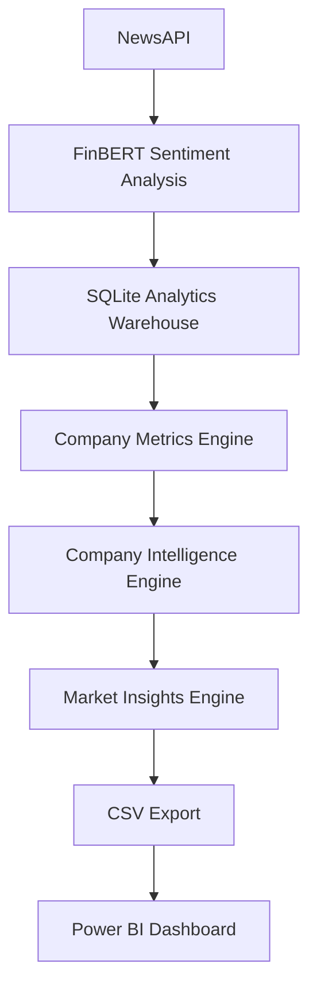
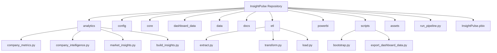
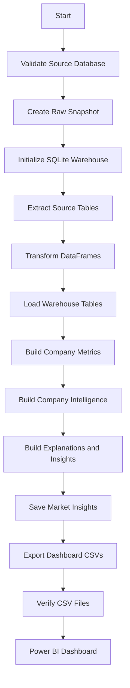
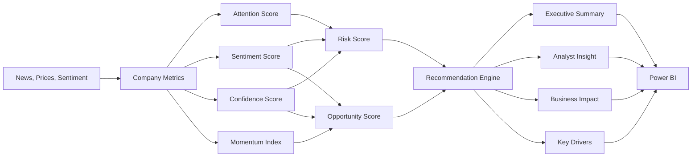
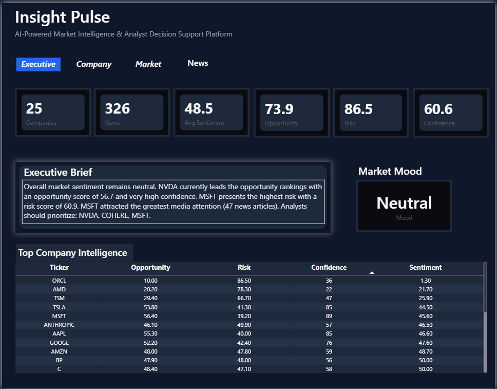
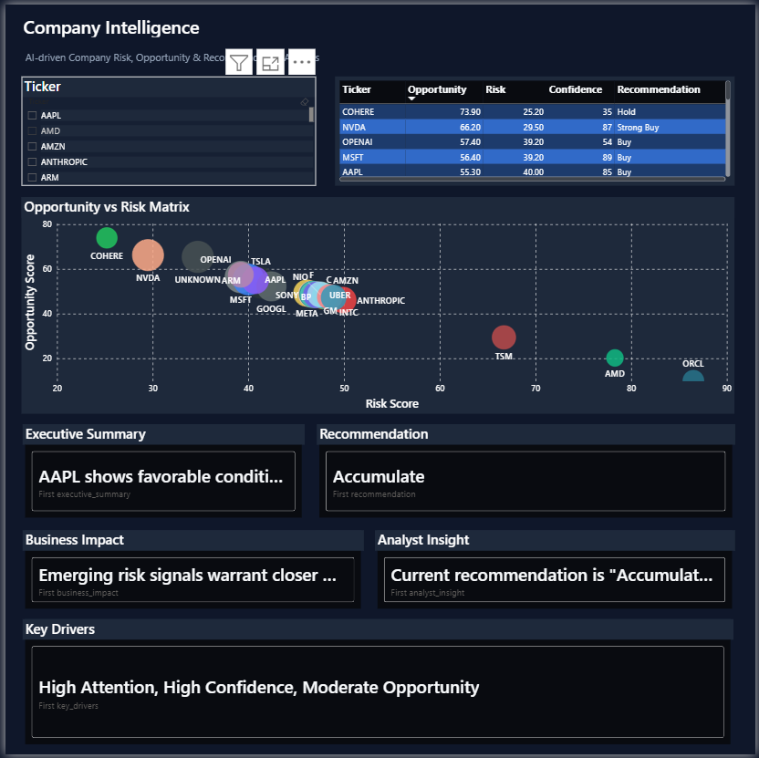
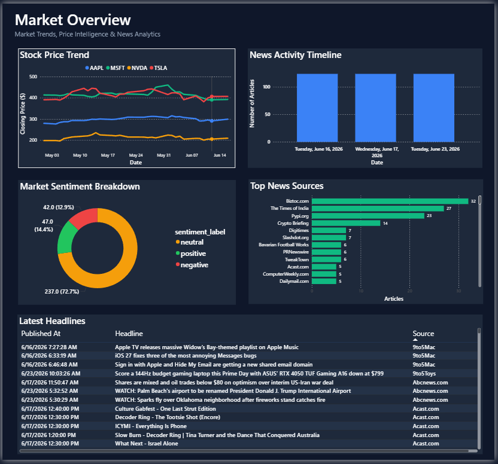
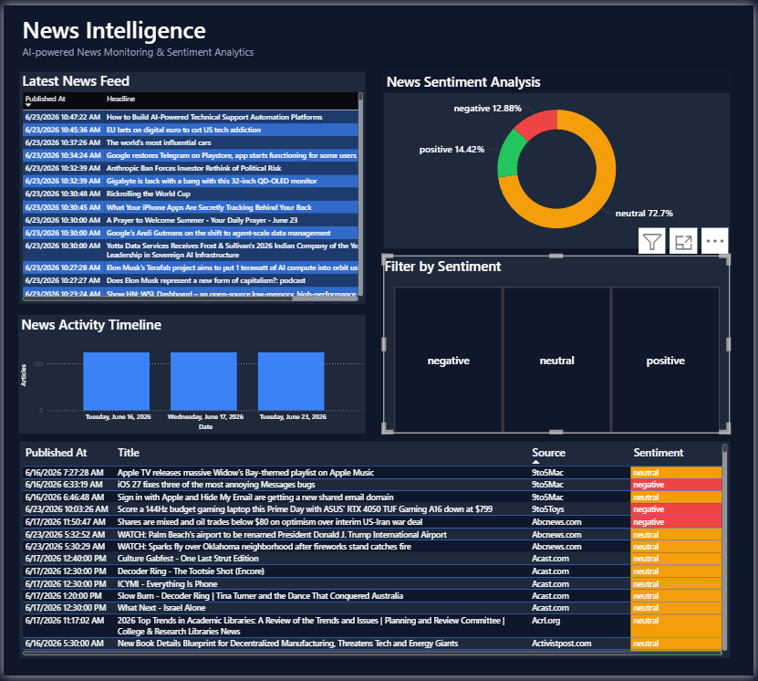
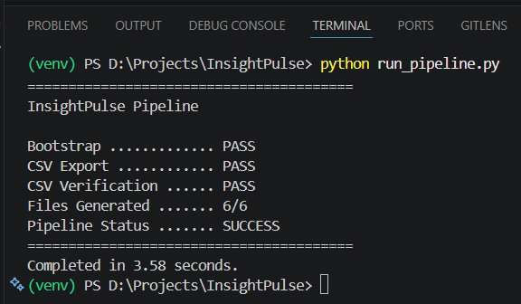

# InsightPulse


InsightPulse is an AI-powered Financial Market Intelligence and Decision Analytics Platform that transforms financial news, sentiment signals, and market data into explainable company intelligence, market insights, CSV exports, and a Power BI dashboard.

InsightPulse is designed for decision support and analytical prioritization. It does not predict stock prices and does not provide financial advice.

## Repository Description

AI-powered financial market intelligence platform that turns NewsAPI and FinBERT sentiment data into SQLite analytics, explainable company intelligence, CSV exports, and a Power BI decision-support dashboard.

## About

InsightPulse is a production-ready analytics project for converting raw financial news and sentiment data into structured business intelligence. The platform combines ETL, SQLite warehousing, scoring models, recommendation logic, explainable insights, and Power BI reporting into a repeatable backend workflow.

## GitHub Topics

```text
financial-analytics
market-intelligence
decision-analytics
business-intelligence
data-engineering
sentiment-analysis
finbert
newsapi
powerbi
python
pandas
sqlite
etl
financial-news
analytics-dashboard
```

## Project Overview

InsightPulse sits on top of a financial data collection layer and converts market news into analyst-ready intelligence. The backend builds a local analytics warehouse, calculates company-level metrics, applies financial scoring logic, generates recommendations, writes market insights, and exports Power BI-ready CSV files.

For the full product intent and decision-support philosophy, see [PROJECT_VISION.md](docs/PROJECT_VISION.md).

## Problem Statement

Financial analysts often need to review large volumes of news, sentiment signals, and company-level market activity before deciding what deserves attention. Raw dashboards can show data, but they often do not explain which companies matter, why they matter, and what evidence supports the conclusion.

InsightPulse addresses this by producing structured intelligence that prioritizes attention, summarizes market behavior, and supports investigation without claiming to forecast prices.

## Key Features

- Automated ETL pipeline from source market data into an analytics warehouse.
- SQLite analytics warehouse for Power BI and downstream reporting.
- Company metrics engine for coverage, sentiment, confidence, price, and volume signals.
- Company intelligence engine with opportunity, risk, momentum, confidence, and attention scores.
- Recommendation engine using financially interpretable labels.
- Market insights engine for executive-level summaries and analyst focus.
- CSV export layer for Power BI compatibility.
- Single-command pipeline automation through `run_pipeline.py`.
- Explainability fields for business impact, analyst insight, key drivers, and recommendation context.

## Architecture Overview

The detailed system architecture is documented in [SYSTEM_ARCHITECTURE.md](docs/SYSTEM_ARCHITECTURE.md) and the warehouse design is documented in [WAREHOUSE_DESIGN.md](docs/WAREHOUSE_DESIGN.md).



## Technology Stack

| Layer                  | Technology               |
| ---------------------- | ------------------------ |
| Data ingestion         | NewsAPI source data      |
| Sentiment intelligence | FinBERT                  |
| Data processing        | Python, Pandas           |
| Analytics storage      | SQLite                   |
| Automation             | Python subprocess runner |
| Dashboarding           | Power BI                 |
| Export format          | CSV                      |

## Project Structure

```text
InsightPulse/
|-- analytics/              # Metrics, intelligence, explanations, market insights
|-- config/                 # Project paths and constants
|-- core/                   # Source, warehouse, snapshot, and logging utilities
|-- dashboard_data/         # Power BI-ready CSV exports
|-- data/                   # Raw snapshots and SQLite analytics warehouse
|-- docs/                   # Architecture, warehouse, product, and scope documents
|-- etl/                    # Extract, transform, load, and save steps
|-- powerbi/                # Power BI helper scripts
|-- scripts/                # Bootstrap and dashboard export commands
|-- assets/                 # Theme and screenshot assets
|-- InsightPulse.pbix       # Power BI dashboard file
|-- requirements.txt        # Python dependencies
|-- run_pipeline.py         # Single-command backend pipeline runner
```



## Data Pipeline

The pipeline is intentionally simple and reproducible. The runner calls the existing backend modules in order and stops immediately if a required step fails.



## Analytics Workflow

The analytics workflow converts company-level data into explainable decision-support outputs. For the business logic and platform principles, see [PROJECT_VISION.md](docs/PROJECT_VISION.md).



## Dashboard Overview

The Power BI dashboard presents prepared analytics rather than recalculating business logic in the report layer. It consumes exported CSV files from `dashboard_data/` and visualizes company intelligence, recommendations, market insights, sentiment, and source data.

## Automation

Run the complete backend workflow with one command:

```bash
python run_pipeline.py
```

The runner executes:

```bash
python -m scripts.bootstrap
python -m scripts.export_dashboard_data
```

It then verifies that all required CSV files were generated:

```text
dashboard_data/company_metrics.csv
dashboard_data/company_intelligence.csv
dashboard_data/market_insights.csv
dashboard_data/news.csv
dashboard_data/prices.csv
dashboard_data/sentiment.csv
```

## AI Scoring Engine

InsightPulse uses sentiment and market activity signals to calculate interpretable company-level scores:

- Attention Score
- Sentiment Score
- Confidence Score
- Momentum Index
- Risk Score
- Opportunity Score

The scoring outputs are stored in the analytics warehouse and exported for Power BI. Detailed design context belongs in the analytics and warehouse documentation, especially [WAREHOUSE_DESIGN.md](docs/WAREHOUSE_DESIGN.md).

## Recommendation Engine

The recommendation engine uses company intelligence outputs to produce analyst-facing labels:

- Strong Buy
- Buy
- Accumulate
- Hold
- Reduce
- Sell
- Insufficient Data

Recommendations are evidence-based decision-support indicators, not investment instructions.

## Power BI Dashboard

The repository includes `InsightPulse.pbix`. Power BI consumes the prepared CSV files in `dashboard_data/`, keeping business logic inside the Python and SQLite pipeline.

Power BI compatibility depends on these exported files:

```text
company_metrics.csv
company_intelligence.csv
market_insights.csv
news.csv
prices.csv
sentiment.csv
```

## Installation

Clone the repository:

```bash
git clone <repository-url>
cd InsightPulse
```

Create and activate a virtual environment:

```bash
python -m venv venv
```

Windows:

```bash
venv\Scripts\activate
```

macOS or Linux:

```bash
source venv/bin/activate
```

Install dependencies:

```bash
pip install -r requirements.txt
```

Confirm that `config/settings.py` points to the local AlphaLens `market.db` source database before running the pipeline.

## Quick Start

```bash
python run_pipeline.py
```

Expected result:

```text
InsightPulse Pipeline

Bootstrap ............. PASS
CSV Export ............ PASS
CSV Verification ...... PASS
Files Generated ....... 6/6
Pipeline Status ....... SUCCESS
```

## Running the Pipeline

Preferred command:

```bash
python run_pipeline.py
```

Manual commands:

```bash
python -m scripts.bootstrap
python -m scripts.export_dashboard_data
```

The manual sequence should only be needed when debugging individual pipeline stages.

## How Power BI Connects

1. Run the backend pipeline.
2. Confirm that the CSV files exist in `dashboard_data/`.
3. Open `InsightPulse.pbix`.
4. Refresh the Power BI model.
5. Power BI reads the prepared CSV exports and displays the latest warehouse output.

## Documentation

| Document                                             | Purpose                                                    |
| ---------------------------------------------------- | ---------------------------------------------------------- |
| [PROJECT_VISION.md](docs/PROJECT_VISION.md)           | Product vision, problem framing, guiding principles        |
| [SYSTEM_ARCHITECTURE.md](docs/SYSTEM_ARCHITECTURE.md) | System layers and platform architecture                    |
| [WAREHOUSE_DESIGN.md](docs/WAREHOUSE_DESIGN.md)       | Analytics warehouse philosophy and data layers             |
| [MVP_SCOPE.md](docs/MVP_SCOPE.md)                     | MVP goals, success criteria, non-goals, definition of done |
| [DATA_MODEL.md](docs/DATA_MODEL.md)                   | Data model reference                                       |
| [PRODUCT_MODULES.md](docs/PRODUCT_MODULES.md)         | Product module reference                                   |

## 📸 Screenshots

### Executive Dashboard



*Executive dashboard showing market mood, priority companies, recommendations, and key KPIs.*

---

### Company Intelligence



*Company intelligence view with opportunity, risk, confidence, momentum, and recommendations.*

---

### Market Overview



*Market overview summarizing sentiment, attention, risk, and opportunity.*

---

### News Intelligence



*News intelligence connecting headlines, sentiment, and company signals.*

---

### Automation Pipeline



*One-command pipeline execution (`python run_pipeline.py`).*

## Demo

Suggested demo flow:

1. Run `python run_pipeline.py`.
2. Show the generated CSV files in `dashboard_data/`.
3. Open `InsightPulse.pbix`.
4. Refresh the dashboard.
5. Review the executive dashboard, company intelligence page, and market insights output.

## Future Scope

Future work should remain aligned with the decision-support principles in [PROJECT_VISION.md](docs/PROJECT_VISION.md) and the non-goals in [MVP_SCOPE.md](docs/MVP_SCOPE.md). The platform should continue to prioritize explainability, analyst productivity, and transparent business logic over unsupported prediction claims.

## License

No open-source license file is currently included. Add a `LICENSE` file before public reuse, redistribution, or external contribution.

## Acknowledgements

- NewsAPI for financial news source data.
- FinBERT for financial sentiment analysis.
- Pandas and SQLite for local analytics processing.
- Power BI for dashboard presentation.
